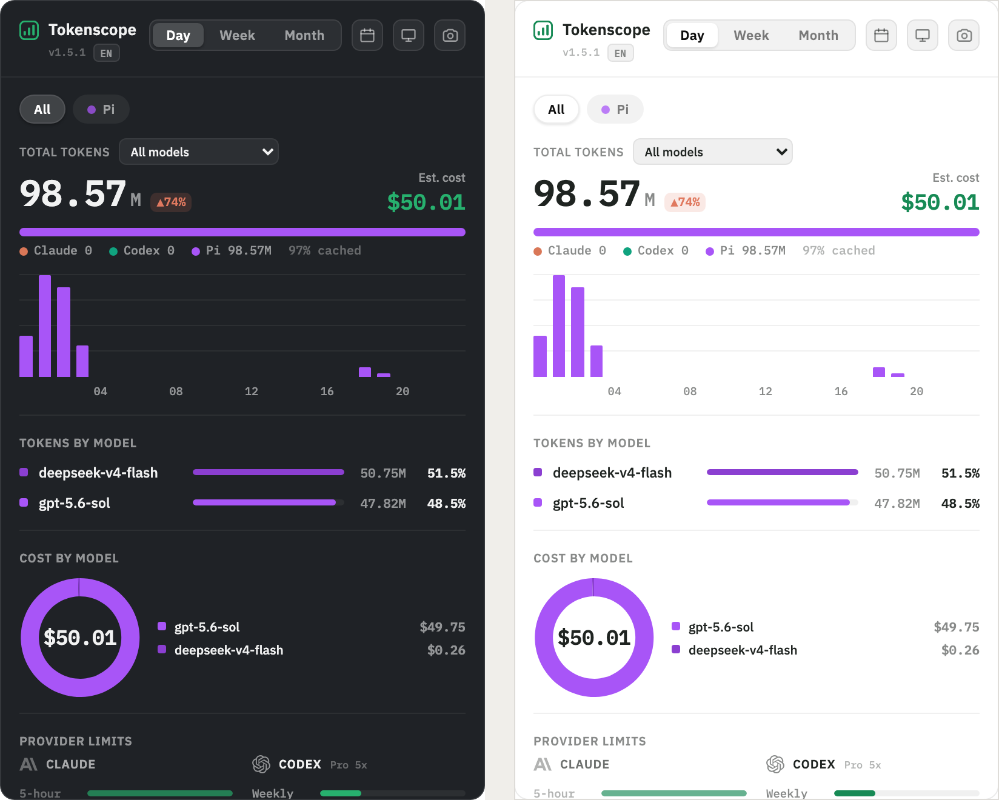

# Tokenscope Remix

**English** · [中文](README-zh.md)

A **menu-bar / system-tray app for macOS and Windows** that shows your **local AI coding agents'** (Pi, Claude Code, and Codex CLI) **daily token usage, estimated cost, and per-model / MCP / Skill call breakdown** — one unified dashboard for every agent on your machine.

Stack: **Tauri 2 + React + TypeScript** (frontend) / **Rust** (data layer).



## Quick install on macOS

Homebrew is the recommended installation and upgrade path:

```bash
brew install --cask sunchj/tokenscope/tokenscope
```

## What it does

- Shows today's token count (all agents combined) next to the menu-bar icon (e.g. `⬡ 14.00M`)
- Click to open the panel: it starts on Day so its total matches the menu-bar count, with Week / Month toggles plus an inclusive custom date-range filter
- **Multi-agent**: with more than one agent detected, filter chips (All / Claude / Codex / Pi) appear — the All view stacks usage **by agent**, and filtering to one agent re-tints the whole panel with its accent (Claude coral / Codex teal / Pi violet). With a single agent the classic UI is unchanged
- Metrics: total tokens (input/output), estimated cost, requests / sessions
- Project settlement: groups usage by local Git repository / working directory and exports the selected period as CSV without exposing raw paths or conversation content
- Reliability telemetry: completed/aborted turns, tool errors/denials, and estimated tokens/cost spent on aborted work; collected incrementally from this version forward
- Context health: median/peak context-window pressure, ≥80% warnings, compaction count, and reasoning-token share when reported by the agent
- Weekly quota trend: downsampled Codex snapshots with daily burn rate and time-to-cap projection for the current reset cycle
- Three breakdowns: **by model** / **by MCP call** / **by Skill call**
- **Codex quota card**: the active weekly rate-limit window (used %, plan, reset countdown) read straight from Codex's own logs
- Cost donut (hover for a single model), year-long activity heatmap
- **Counts only the MCP servers / Skills you installed yourself** — all built-in tools and bundled MCP servers are filtered out

## Data sources (zero-intrusion, read-only)

| Purpose | Path |
|---------|------|
| Claude session logs (tokens / model / tool calls) | `~/.claude/projects/**/*.jsonl` |
| Codex session logs (tokens / model / rate limits) | `~/.codex/sessions/**/*.jsonl` (honors `CODEX_HOME`) |
| Pi session logs (tokens / model / tools / telemetry) | `~/.pi/agent/sessions/**/*.jsonl` (honors `PI_CODING_AGENT_DIR`, `PI_CODING_AGENT_SESSION_DIR`, and absolute `settings.sessionDir`) |
| Claude user MCP whitelist | `~/.claude.json` → `mcpServers` + `projects[*].mcpServers` |
| Codex user MCP whitelist | Global and trusted-project `config.toml` → `[mcp_servers.*]` (`$CODEX_HOME/config.toml`, project `.codex/config.toml`) |
| User Skill whitelist | Claude: `~/.claude/skills/`; Codex: `$CODEX_HOME/skills/`, `~/.agents/skills/`, and project `.agents/skills/`; Pi: global/shared/project Pi skill locations plus explicit settings paths |
| Model prices | **Primary**: [models.dev](https://models.dev/api.json) (bare model names, matching the CLI logs) → **Fallback**: [LiteLLM](https://raw.githubusercontent.com/BerriAI/litellm/main/model_prices_and_context_window.json) → built-in snapshot. Cached in `~/Library/Caches/tokenscope/`, refreshed every 24h, with offline fallback |

### Key processing
- Claude: deduplicated by `message.id` (streaming/retries repeat the same usage); when one message spans multiple lines, its tool calls are merged and the token usage is counted once
- Codex: a dedicated adapter cross-checks exact per-response `last_token_usage` against the accumulated `total_token_usage` snapshot, so quota-only repeats and fork replays are not counted as new work; stable `(turn, total snapshot)` ids deduplicate persisted replays, while `cached_input_tokens` and `cache_write_input_tokens` are split out of Codex's inclusive `input_tokens` for comparable four-category accounting
- Pi: each persisted assistant response contributes its exact four-way `usage`; stable tree-entry ids deduplicate history copied by `/fork` or `/clone`, while the session header supplies the session/project identity. Persisted request cost, reasoning, stop reason, tool errors, compactions, and model context windows feed the matching dashboard telemetry
- Token split: `input` (uncached) / `cache` (creation+read) / `output`; the UI folds cache into "In" by default and shows a separate "cached %"
- Price matching: exact id → normalized id (strip vendor prefix + `.`↔`p`, e.g. `glm-5.1`⇄`glm-5p1`); models.dev's official bare-name price wins
- Cost is priced per the four token types; Pi's persisted request cost is preferred when available. Each model carries a `priced` flag — **models not found in any price source still count tokens but are labelled "no price" in the UI**
- Logs contain only the bare model name (no vendor) → third-party models default to the official vendor price (an estimate)
- Tool classification: MCP calls are attributed from direct `mcp__<server>__*` names, Codex tool-search mappings, or Codex App custom calls, then checked against the owning agent's config; Claude Skill tool/slash-command calls plus Codex and Pi `SKILL.md` reads are matched against that agent's user/project skill directories; everything else is ignored

> Cost is an **estimate** based on public prices; subscription users should read it as "equivalent spend value".

### Token types & cost formula

Every assistant message's `usage` reports four **mutually exclusive** token counts (they never double-count the same token):

| Stage | `usage` field | What it is | Price (relative to input) |
|-------|---------------|------------|---------------------------|
| **Input** (uncached) | `input_tokens` | New prompt tokens sent this turn | 1× |
| **Cache write** | `cache_creation_input_tokens` | Context written into the prompt cache | ~1.25× |
| **Cache read** (hit) | `cache_read_input_tokens` | Context replayed from the cache | ~0.1× (much cheaper) |
| **Output** | `output_tokens` | Tokens the model generated | ~5× |

Pi persists the same categories as `usage.input`, `usage.cacheWrite`, `usage.cacheRead`, and `usage.output`; its optional `usage.reasoning` is already a subset of output and is never added again.

**Tokens** (per period, summed over messages):

```
total  = input + cache_creation + cache_read + output
# the UI shows:  In = input + cache_creation + cache_read,  Out = output,  cached % = cache_read / total
```

**Cost** (each stage priced at its own per-token rate from the price table):

```
cost = input            × price.input
     + cache_creation   × price.cache_creation
     + cache_read       × price.cache_read     # cache hits billed at the discounted read rate
     + output           × price.output
```

So a cache hit is **not** billed as normal input — it uses the dedicated (cheaper) `cache_read` rate, which is why heavily-cached usage shows a huge token count but a modest cost. The UI folds cache into "In" for display only; billing always uses the four separate rates above.

## Install

### macOS: Homebrew (recommended)

Homebrew is the primary installation method for macOS. It provides one-command
installation, handles Gatekeeper quarantine automatically, and keeps upgrades
predictable.

```bash
brew install --cask sunchj/tokenscope/tokenscope
```

The cask's `postflight` strips the quarantine attribute (`xattr -cr`) automatically, so **it opens on first launch without the "Apple cannot verify" prompt**.

After you open it once it registers as a login item, then **launches in the menu bar automatically on every boot**.

Upgrade:

```bash
brew update && brew upgrade --cask tokenscope
```

### macOS: Download the .dmg (fallback)

1. Download the latest `Tokenscope_*_universal.dmg` from [Releases](https://github.com/SunChJ/tokenscope-remix/releases) (works on both Apple Silicon and Intel)
2. Drag it into Applications
3. Because the build is **unsigned / unnotarized**, Gatekeeper blocks the first launch — pick one:
   - Right-click the app → **Open** → confirm **Open** again, or
   - Run once in the terminal:
     ```bash
     xattr -cr /Applications/Tokenscope.app && open /Applications/Tokenscope.app
     ```

> Unsigned is a current known limitation. A true "double-click to open" experience requires Apple Developer ID signing + notarization — see `PRD.md` §6.4.

### Windows

1. Download the latest `Tokenscope_*_x64-setup.exe` from [Releases](https://github.com/SunChJ/tokenscope-remix/releases)
2. Double-click to install. Because the build is **unsigned**, Windows SmartScreen will warn on first run — click **More info → Run anyway**
3. The app installs per-user (no admin required) and registers itself for **launch at login** automatically
4. Requirements: **Windows 10 1803+ / Windows 11** with the WebView2 runtime (preinstalled on Windows 11; Windows 10 users without it will be prompted by the installer)

### Updating

The app checks for new releases on launch and every hour. Its version and update
actions appear directly below **Tokenscope** in the top-left corner. Homebrew
users should keep using `brew upgrade --cask tokenscope`; direct-download users
can update and restart from the app. Use **Check for Updates…** in the tray's
right-click menu to check immediately.

### After first launch

- **macOS**: an icon plus today's token count appears in the menu bar (e.g. `⬡ 12.40M`)
- **Windows**: the tray icon appears in the notification area. The Windows tray API doesn't show a label beside the icon — **hover the tray icon** to see today's token count in the tooltip (e.g. `Tokenscope · today 12.40M`)
- Left-click the icon to toggle the panel; right-click for the menu (Open / Refresh / Check for Updates / display preferences / Quit)
- **Weekly Remaining** controls the quota shown beside the menu-bar token count: **Off**, **Codex** (for example `12.40M-C76%`), or **Codex + Spark** (`codex_bengalfox`, shown as `12.40M-C76%-S93%`). Expired quota snapshots are hidden; the setting is off by default and remembers your choice
- **Dashboard Shortcut** toggles the panel with a global hotkey (`⌥⌘T` on macOS, `Ctrl+Alt+T` on Windows/Linux by default); use **Change Dashboard Shortcut…** to record your own combination. It is off by default and remembers your choice
- **Launch-at-login is set up automatically** — no manual configuration needed

## Develop

```bash
pnpm install
pnpm tauri dev         # launch the desktop app (requires the Rust toolchain)
```

Frontend-only preview (using the real-data snapshot `public/dev-dashboard.json`):

```bash
pnpm dev               # http://localhost:1420
# refresh the snapshot:
cd src-tauri && cargo run --example dump > ../public/dev-dashboard.json
```

## Build

```bash
pnpm tauri build       # outputs .app / .dmg on macOS, .exe (NSIS) on Windows to src-tauri/target/release/bundle/
```

For distribution see `PRD.md` §6.3 (Homebrew Cask recommended on macOS; direct `.dmg` / `.exe` downloads benefit from code signing + notarization).

## Release

Keep all app version files in sync with the bundled helper:

```bash
pnpm version:set 1.3.4
pnpm version:check
git commit -am "release: v1.3.4"
git push origin main
```

A version change pushed to `main` is validated by GitHub Actions, tagged as
`vX.Y.Z`, then built and published for macOS and Windows together with signed
updater artifacts and `latest.json`. A matching existing tag can also be run
manually from the Release workflow for recovery. The release workflow requires
`TAURI_SIGNING_PRIVATE_KEY` and `TAURI_SIGNING_PRIVATE_KEY_PASSWORD` secrets.

## Structure

```
src/                  React frontend
  data.ts             types + Tauri bridge + theme + formatting
  charts.tsx          chart primitives (bars / donut / sparkline / heatmap / segmented control)
  App.tsx             main panel
src-tauri/src/
  store.rs            incremental multi-source JSONL ingest (Claude + Codex + Pi adapters)
  parser.rs           aggregation into scopes (All / per-agent; presets + custom ranges + heatmap)
  pricing.rs          models.dev / LiteLLM price loading and costing
  config.rs           user MCP / Skill whitelists (Claude + Codex + Pi)
  model.rs            data structures returned to the frontend
  lib.rs              Tauri commands + menu-bar tray
```

## Bug log

Notable bugs found during development — symptom, root cause, and fix — are
collected in [docs/BUGFIXES.md](docs/BUGFIXES.md).

## Acknowledgements

This project started as a remix of [tokenscope](https://github.com/HduSy/tokenscope) by [@HduSy](https://github.com/HduSy) — a beautifully built macOS menu-bar dashboard for Claude CLI usage. The clean Rust ingest/aggregation architecture and the panel design this project inherits are his work, and this repo remains under the original MIT license. Huge thanks! 🙏

Tokenscope Remix extends it into a multi-agent dashboard (Codex today, more planned — see [docs/DESIGN-multi-agent.md](docs/DESIGN-multi-agent.md)) and is maintained independently: please file issues and feature requests here, not upstream.
